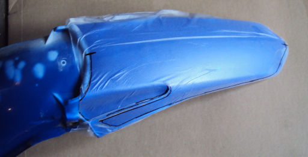

# mx-graphics

Templates, logos and sample design files for motorcycle graphics and decals.  Most files are in the [Scalable Vector Graphics](https://en.wikipedia.org/wiki/Scalable_Vector_Graphics) (SVG) format and use the splitdesignsco [color palette](splitdesignsco.gpl).

## Templates

Model specific templates for motorcycle graphics.  Files include Roland style magenta cut lines and blank print areas.

## Create your own templates

To create your own templates follow these steps:

* Apply *Glad Press’n Seal* or similar weak adhesive flexible transfer film to the part.  The film needs to be applied smoothly without any wrinkles or big air bubbles.  For big panels overlap two sheets and apply tape to hold them together.

* Trace an outline of the desired cut line using a good [Sharpie](http://www.sharpie.com) like permanent marker.  For fender templates and other parts that have symmetry along the center line make tick marks where the cut line crosses the center line.  It may be best to not include cuts for bolt holes, etc., as those tend to be hard to position correctly on a new template.

* Remove the transfer film carefully as to not stretch or distort it.

* Fix the transfer film to a thick paper or card stock backing with tape as best you can.  White backgrounds work best.

* Most computer printers will have 'scan document' function.  Set the scan to the largest document size and a medium resolution.  Adjust the scan contrast if needed to get a good result.  For big panels that need multiple scans take the first scan then try to minimise the rotation of the film as you move it for subsequent scans.  Image editors will have a rotate feature, but the accuracy of the resulting template will be better if its use is minimal.

* Import the scan file into an SVG image editor like [Inkscape](https://inkscape.org).  The scan will be a [raster image](https://en.wikipedia.org/wiki/Raster_graphics).

* Use the editor's 'Bezier Curve' tool to create a vector shape of the cut line.  Put the cut line into a different layer of the image than the scan image.  The general standard is for cut lines to be magenta (hex color #ff00ff) at 0.25 points.

* Creating templates with symmetry is important.  For graphics that are along the center line, use the center line tick marks to create an editor guideline that runs along the center of the scan image.  Create the vector cut line for only one side of the center line then do a mirror flip for the other.  Shrouds and tank graphics are usually just mirror images.  For parts that are almost the same side to side like fork guards, side panels and air box choose one side to be the 'master' and the other to be the derivative.  Work on the master then create the derivative from a copy of the master.

* Once you have something that looks good print it to paper, cut it out, and see how it fits on the original part.  You'll need to make notes, go back to editing, and make hard copies several times.  Remove the original raster image when you no longer need it.

* Printing services will require a printed area that is 5 millimeters beyond the cut line.  Use your editor's [outset feature](https://inkscape.org/en/doc/tutorials/advanced/tutorial-advanced.html) to create a background for the graphic.  For convenience later, put the cut line and print area into different layers of the image.

This is all pretty tedious work, but its satisfying once you have your own templates and you can begin the design of your graphics.

## Template example by steps

Here are the results of creating a template for a YZ125/250 rear fender.

The fender with *Glad Press’n Seal* applied.  Note center line tick marks.  The edge of a decal can't be just after a sharp bend otherwise it will eventually peel up and dirt will get under there, hence the need for a cut out on the side of this fender.  The very back edge of this fender has a sharp downward curve, so to avoid having the edge of the graphic peal up, the graphic ends just before that downward curve.

The transfer film fixed to a cardboard backing ready to scan.

Two scanned images made at 11x17 tabloid.

The vector cut line created on top of a composite of the two scanned images.  To start, use the editor's rotate feature to rotate the scanned image composite so that the center line tick marks are horizontal in the editor.  That allows one to create the lower half of the cut line, create a mirror image for the top half, position the top half, and then combine the two halves into a single closed path.

Testing the fit of the cut line with a hard copy printed to paper.  Note the markings where adjustments are needed.

Adjustments to the vector image.  As an aid in editing, create a duplicate of the object, change its color and move it to below the original as seen here with the light green path.

Creating the outset.

Convert the outset to a path and set the fill to create the template background.

This pair of vector paths for the cut lines of a YZ125/250 gas tank illustrate the concept of master and derivative.  It is fairly typical for a tank to have its upper part shaped identically on both sides, and have the shape of the lower part differ to accommodate the petcock and to allow access to the spark plug.  First choose one side as the master.  Work on the cut line for it until satisfied, then create a duplicate of the path and modify the duplicate as needed to fit.

To minimize bubbling, gas tank graphics need venting.  Add the [vent sheet](templates/generic/tank-vent-sheet.svg) to the cut layer and remove the unneeded parts.

Once templates are created for the individual parts they can be combined to form an image of the whole bike. This view is useful when creating a graphic theme that extends through the length of the bike.  Here an image of the bike in an opaque background layer is used as a guide, and the individual template images are positioned in foreground layers.

## Motivation

Artwork ready to send out for printing.

The result.

## Licence & Usage

All files in the [mx-graphics project](https://github.com/moto-design/mx-graphics), unless otherwise noted, are covered by the [Fabricators Design License](https://github.com/moto-design/mx-graphics/blob/master/fabricators-design-license.txt).  The text of the license describes what usage is allowed, and what obligations users have if they choose to use any files.
