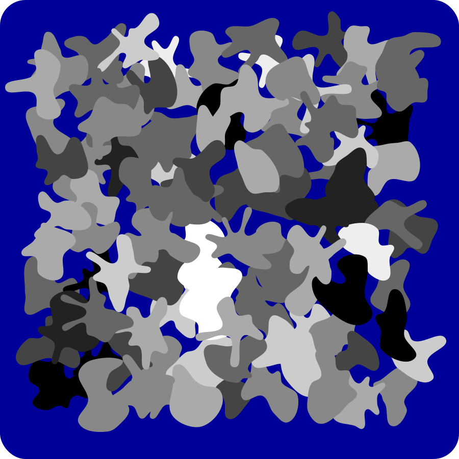
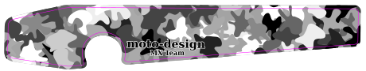

# moto-design Image Generators

See the [INSTALL](INSTALL) file for installation info.

## blob-generator

Generates SVG file of camouflage blobs.

### Samples

## Licence & Usage

All files in the [mx-graphics project](https://github.com/moto-design/mx-graphics), unless otherwise noted, are covered by the [Fabricators Design License](https://github.com/moto-design/mx-graphics/blob/master/fabricators-design-license.txt).  The text of the license describes what usage is allowed, and what obligations users have if they choose to use any files.
